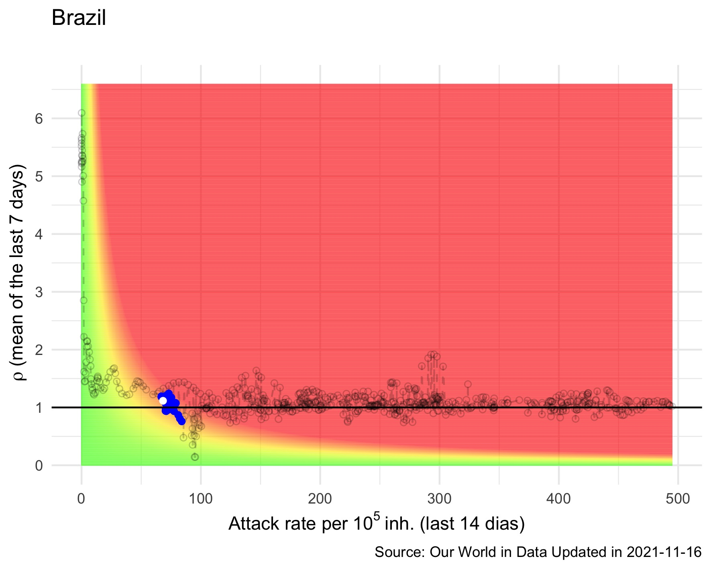

# Risk diagrams for COVID-19

In this repository you can find the R code to generate the risk diagrams to follow up COVID-19 dynamics in any place, at state, region or country level.
The proposed methodology can be found at https://www.frontiersin.org/articles/10.3389/fpubh.2021.633123/full.

In the figure below, you can see the risk diagram for Brazil, where the blue dots represents the last 30 days, and the white one represents the current situation.

